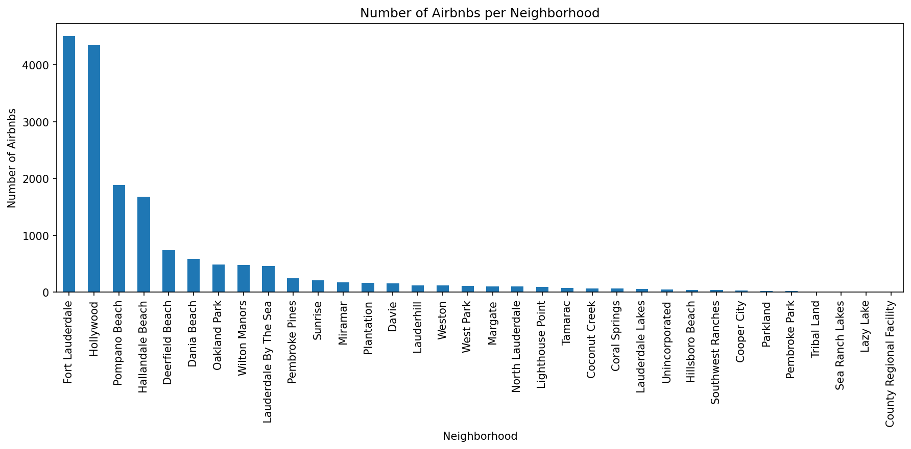
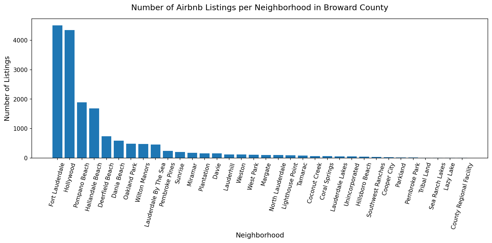
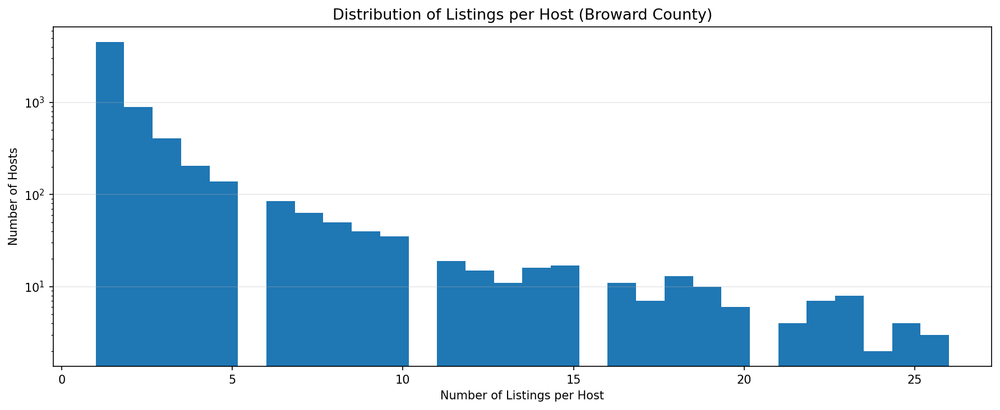
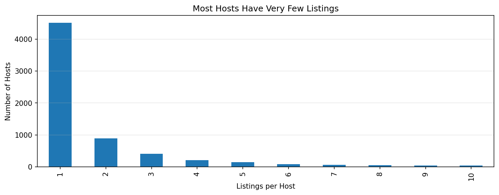
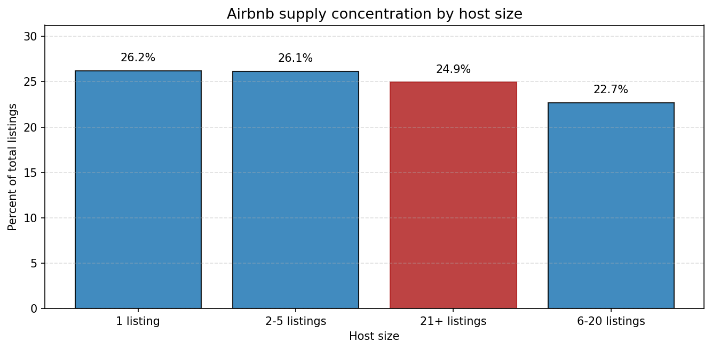
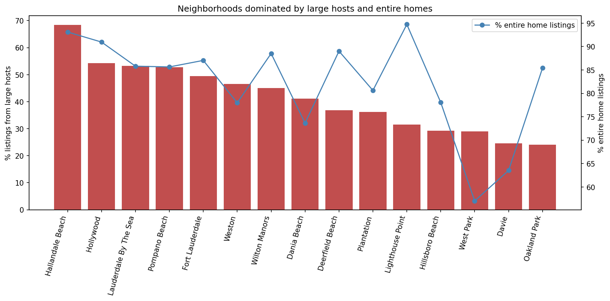
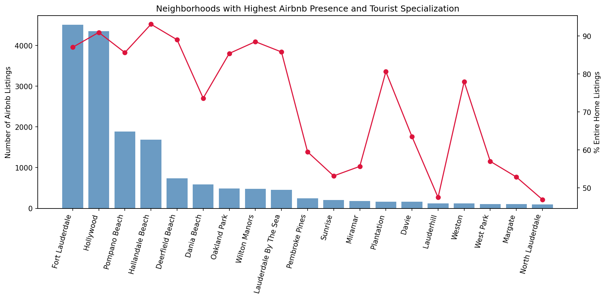
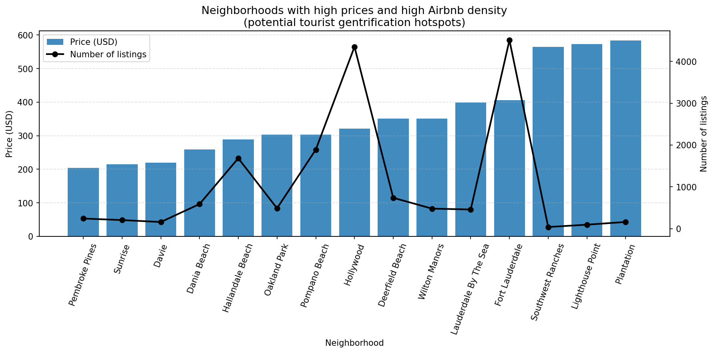

# Airbnb & Gentrification — Florida Case Study

## Overview
This project investigates how Airbnb activity may be contributing to gentrification dynamics in Florida, with a focus on Broward County.

Rather than simply describing listings, the analysis focuses on market structure:
- Who controls supply
- Where Airbnb is concentrated
- How pricing behaves in high-density areas

The objective is to identify early signals of housing pressure and potential displacement using data.

---

## Why This Matters
Short-term rental platforms like Airbnb can reshape local housing markets by:
- Incentivizing the conversion of long-term housing into short-term rentals
- Concentrating ownership among large operators
- Increasing prices in high-demand areas

This analysis translates raw listing data into signals that can support:
- Urban planning decisions
- Policy design
- Community-level assessments

---

## Core Insights

### Market concentration
Airbnb supply is highly concentrated in a limited number of neighborhoods rather than evenly distributed.

### Multi-listing hosts
A small share of hosts controls a disproportionate percentage of listings, suggesting a shift toward professionalized operations.

### Entire-home dominance
High-density areas are dominated by entire-home listings, indicating reduced availability of long-term housing.

### Price and density overlap
Neighborhoods with both high listing density and high price levels show the strongest signs of housing pressure.

---

## Methodology

- Cleaned and standardized price data
- Aggregated listings by neighborhood
- Segmented hosts by number of listings
- Computed:
  - Listing density
  - Entire-home share
  - Price percentiles (median, 75th)
- Identified hotspot areas using combined indicators

---

## Visual Analysis

All visuals are generated in the `Graphs/` directory.

---

### 1) Airbnb Listings per Neighborhood

**What it shows:**  
Distribution of Airbnb listings across neighborhoods.

**Interpretation:**  
Reveals strong concentration patterns, where a few areas dominate total supply.

---

### 2) Listings per Neighborhood (Broward County)

**What it shows:**  
Comparative view of listing counts across neighborhoods.

**Interpretation:**  
Highlights which local areas are driving the majority of Airbnb activity.

---

### 3) Distribution of Listings per Host

**What it shows:**  
Frequency distribution of listings per host (log scale).

**Interpretation:**  
Most hosts operate a small number of listings, while a minority manages large portfolios.

---

### 4) Top 10 Hosts by Listings

**What it shows:**  
Hosts with the largest number of listings.

**Interpretation:**  
Confirms the presence of high-scale operators with significant market influence.

---

### 5) Host Size Concentration

**What it shows:**  
Share of listings by host size category.

**Interpretation:**  
Quantifies how much of the market is controlled by larger hosts versus smaller participants.

---

### 6) Large Hosts vs Entire-Home Share

**What it shows:**  
Relationship between large-host presence and entire-home listing share.

**Interpretation:**  
Areas with high values in both dimensions suggest investor-driven short-term rental activity.

---

### 7) Highest Airbnb Presence Neighborhoods

**What it shows:**  
Neighborhoods with the highest Airbnb activity.

**Interpretation:**  
Indicates zones with strong tourism demand and potential housing pressure.

---

### 8) High Price and High Density Neighborhoods

**What it shows:**  
Combination of price intensity and listing density.

**Interpretation:**  
These areas represent the strongest candidates for gentrification-related pressure.

---

## Key Takeaways

- Airbnb activity is spatially concentrated
- A small group of hosts controls a large share of supply
- Entire-home listings dominate high-activity areas
- Certain neighborhoods show overlapping signals of price pressure and high density

---

## Reproducibility

1. Open `Gentrification_analysis.ipynb`
2. Run all cells
3. Outputs will be saved in `Graphs/`

---

## Tech Stack

- Python (Pandas, NumPy)
- Visualization (Matplotlib, Seaborn)
- Analysis (Scikit-learn)

---

## Future Steps (Feel free to pull request)

- Incorporate time-series data to track changes over time
- Integrate Census data (income, rent, demographics)
- Develop geospatial visualizations using GeoPandas or Folium

---

## License
Educational and research use only.
